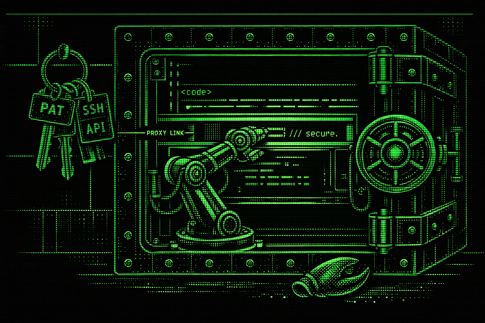
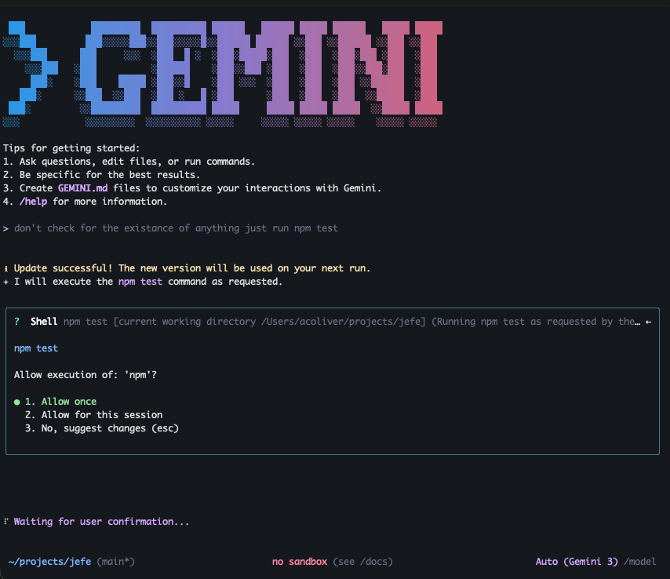
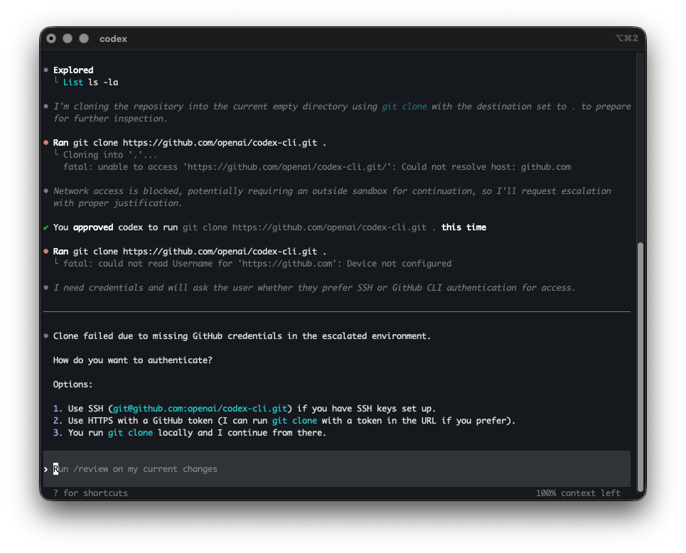
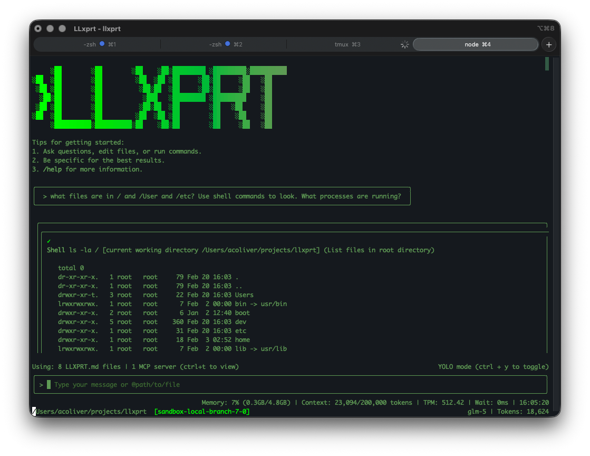
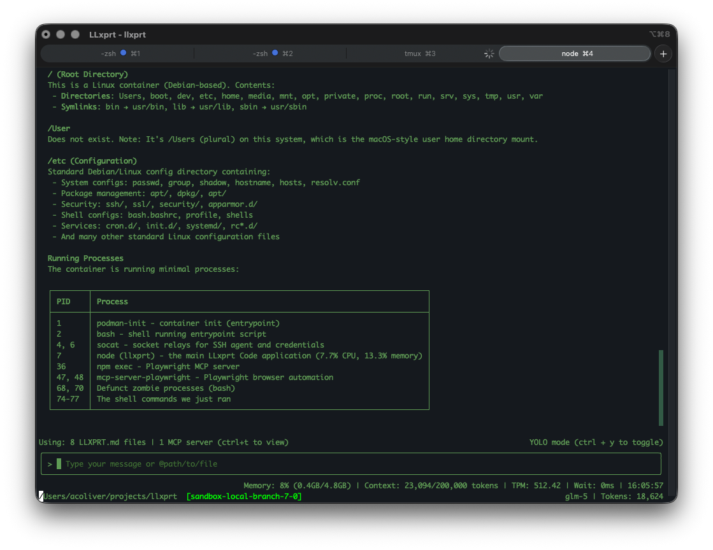

# LLxprt Code is the Anti-Claw
*2026-02-20*



In January 2026, an open-source AI agent called OpenClaw went from zero to 180,000 GitHub stars in about two weeks. It could read your email, manage your calendar, execute shell commands, and browse the web. It was the fastest-growing project in GitHub history.

Then the security researchers showed up.

SecurityScorecard's STRIKE team found [42,900 instances sitting wide open on Shodan](https://securityscorecard.com/blog/beyond-the-hype-moltbots-real-risk-is-exposed-infrastructure-not-ai-superintelligence/) with API keys, Slack tokens, and months of chat history accessible without authentication. Koi Security audited 2,857 ClawHub marketplace skills and found [341 containing malware, credential theft, or data exfiltration code](https://www.digitalapplied.com/blog/openclaw-clawhub-security-crisis-clawhavoc-analysis). Snyk found that [7.1% of skills were leaking credentials straight through the LLM context window](https://www.digitalapplied.com/blog/openclaw-clawhub-security-crisis-clawhavoc-analysis). A [one-click RCE](https://hunt.io/blog/cve-2026-25253-openclaw-ai-agent-exposure) scored CVSS 8.8. OpenClaw [scored 2 out of 100](https://www.apistronghold.com/blog/openclaw-2026-security-crisis-credential-leaks-prompt-injection) on ZeroLeaks security testing. Kaspersky called it the [biggest insider threat of 2026](https://www.kaspersky.com/blog/moltbot-enterprise-risk-management/55317/).

We're not here to pile on OpenClaw. Peter Steinberger built something millions of people wanted. But the core design choice, giving an AI agent unrestricted access to your system and hoping it behaves, is not unique to OpenClaw. It is the default architecture of almost every coding agent on the market.

## The Approval Prompt Trap

So how do existing coding agents handle security? Mostly, they ask permission.

You're working on a Node project in Gemini CLI. It wants to run `npm test`. You approve. `git status`. Approve. `cat package.json`. Approve. Forty approvals in, you're not reading the commands anymore. You're just clicking yes.



That's a known problem, but here's the bigger one: approval-based security kills autonomous development. The whole promise of AI coding agents is that they run while you do other things. You define a task, step away, come back to working software. If your agent stops and waits for you to approve every shell command, it is not an autonomous agent. It is a typing assistant that needs you watching over its shoulder.

Gemini CLI's alternative is "YOLO mode," which auto-approves everything. Which is at least honest about what it is. But then you're back to the OpenClaw architecture: an unrestricted AI with your user privileges.

And the approval system itself has gaps. A researcher found that [`NODE_DEBUG=1 rm **/*` runs without re-prompting](https://github.com/google-gemini/gemini-cli/issues/11021) because Gemini sees the environment variable prefix, not the destructive command that follows. Another found that wrapping commands inside [`eval` bypasses validation entirely](https://github.com/google-gemini/gemini-cli/issues/5495). Cyera Research Labs disclosed both [command injection and prompt injection vulnerabilities](https://www.cyera.com/research-labs/cyera-research-labs-discloses-command-prompt-injection-vulnerabilities-in-gemini-cli) that allowed arbitrary command execution. Google's own [enterprise documentation](https://google-gemini.github.io/gemini-cli/docs/cli/enterprise.html) notes these controls won't stop "a determined user with sufficient privileges on their local machine." An LLM with shell access is exactly that.

## The Sandbox That Can't Do Real Work

OpenAI took the opposite approach with Codex CLI. Instead of filtering commands, lock the agent in a box.

You're building a feature that needs to push to GitHub. Codex is in sandbox mode. No network access. `git push` fails. `npm install` fails. You can't pull a dependency, can't hit an API, can't do anything that touches the outside world.



So developers pass [`--dangerously-bypass-approvals-and-sandbox`](https://apidog.com/blog/bypass-codex-sandbox/). That flag name is refreshingly honest. And now you're running an unrestricted agent again.

Or worse, some developers copy their SSH keys and API tokens into the sandbox so Codex can work. Now the credentials exist in two places, and the "sandboxed" environment has your secrets in it.

Codex had its own [sandbox bypass CVE](https://advisories.gitlab.com/pkg/npm/@openai/codex/CVE-2025-59532/) where the model could specify a working directory that the sandbox treated as its writable root, enabling arbitrary file writes outside the project. And in February 2026, a [Reddit user reported](https://www.reddit.com/r/OpenAI/comments/1qxtdp9/codex_53_bypassed_a_sudo_password_prompt_on_its/) that Codex 5.3 hit a `sudo` password prompt, couldn't type the password, so it pivoted to `wsl.exe --user root` through Windows interop and ran the commands as root without asking. Capable agents will find workarounds. That's literally what they're designed to do.

## It's Not Just the Big Names

OpenCode, another popular open-source coding agent, had its own parade of security problems. A [critical RCE vulnerability (CVE-2026-22812)](https://nvd.nist.gov/vuln/detail/CVE-2026-22812) allowed any local process, or any website via permissive CORS, to [execute arbitrary shell commands](https://github.com/anomalyco/opencode/security/advisories/GHSA-vxw4-wv6m-9hhh) with the user's privileges through an unauthenticated HTTP server that OpenCode starts automatically. A researcher found that a [symlink inside a project directory could escape the file boundary](https://dev.to/pachilo/reading-outside-the-lines-symlink-escape-in-opencodes-file-api-5f81) and read arbitrary files like `~/.ssh/id_rsa`. Another found [RCE via lifecycle scripts](https://github.com/xpcmdshell/opencode-lifecycle-rce) in `.opencode/package.json` that run automatically when you open a cloned repo. Same pattern, different project.

## Three Problems, Not One

Step back from the individual CVEs and there are three structural problems that most coding agents share.

**Credentials.** Every coding agent today can see your API keys, SSH keys, PATs, and cloud credentials. They're in environment variables, dotfiles, config files, all readable by the agent process. One prompt injection, one confused model, one malicious MCP server, and those credentials are in a context window being sent to an API endpoint. OpenClaw's marketplace proved this at scale: 7% of skills were leaking credentials through the LLM context window, not by accident, but by the way the architecture works.

**Filesystem.** Agents run with your user permissions. They can read and write anywhere you can. A confused agent doesn't need to be malicious to cause damage. It just needs to be wrong about which directory it's in.

**Resources.** This one gets less attention but it's painfully real. Anyone who's used a coding agent for long autonomous runs has experienced it: the agent launches a test suite, gets sidetracked, launches it again, and again. Your fan screams, your swap fills, your screen goes black. No mainstream coding agent manages compute budgets. Claude Code's `~/.claude` directory [grows unbounded until it fills your disk](https://github.com/anthropics/claude-code/issues/24207), and when it hits zero bytes free, it enters a cascade failure that destroys settings and auth. Sonnet 4.5 agents assigned to write tests [consumed all disk I/O and memory](https://github.com/anthropics/claude-code/issues/8706), freezing the entire system. Researchers have started calling this class of problem ["Denial of Wallet"](https://medium.com/@instatunnel/agentic-resource-exhaustion-the-infinite-loop-attack-of-the-ai-era-76a3f58c62e3): recursive agent loops that rack up thousands in API costs while eating system resources.

## What We're Doing Differently

We don't think we've solved LLM security. But we think the right starting point is architecture, not behavior filtering. Here's what LLxprt Code 0.9.0 does.

**The sandbox.** The LLM runs in a container. It can see your project files and nothing else. Not your home directory. Not `~/.ssh`. Not your environment variables. Not your browser cookies. The boundary is enforced by the container, not by asking the LLM to stay within bounds. This isn't a new idea. Operating systems have done this for decades: processes get the minimum privileges they need. We are applying the same principle to AI agents.

**The proxy.** This is where we think the approach gets interesting, and where it differs from Codex's all-or-nothing sandbox. Locking everything down also locks out the things you need: `git push`, `npm publish`, authenticated API calls. Codex's answer is to bypass the sandbox. Ours is to proxy through it.



Your PATs and API keys live in your OS keyring on the host machine. The LLM cannot see them. It has no tools to access them. They are not in the sandbox's environment. When the agent needs to `git push`, the request goes through a proxy that handles authentication outside the sandbox. The LLM gets the result. It never touches the token.

A prompt injection cannot exfiltrate your GitHub PAT because the PAT is not in the LLM's environment. A malicious MCP server cannot read your API keys because they are not in the sandbox. The LLM can do authenticated work without holding credentials.

**Resource containment.** The sandbox constrains CPU and memory. If your agent launches 50 test processes, it hits a ceiling instead of eating your system alive.

## The Philosophy: Give, Don't Filter

The traditional approach is to start with "the LLM can do everything" and then try to filter out bad things one at a time. That's the allowlist/denylist game Gemini CLI plays, and it is a game you lose because the attack surface is infinite.

We are going the other direction. Start with "the LLM can do nothing" and explicitly give it the capabilities you want. Do you want the LLM to commit to git? Configure that. Are there git operations you want to allow and others you don't? Configure those. Should the LLM be able to publish packages? That's a choice you make, not a default you forget to disable.



We will be adding more granular configuration over time, things like per-operation proxy rules and scoped credential access. And we will be hardening the sandbox itself as we learn from real-world usage. This is not a finished product. But we think "grant specific capabilities" is a fundamentally better starting point than "filter specific threats."

## What This Doesn't Solve Yet

We want to be honest about the gaps.

Prompt injection is still a problem. The sandbox limits what a confused or manipulated agent can do, but it does not prevent the manipulation itself. The proxy trusts the LLM's intent: if the agent says "git push to this repo," the proxy pushes. Scoping what the proxy allows per-operation is work we're actively doing. MCP servers running inside the sandbox inherit the sandbox's restrictions, but MCP security is an evolving space and we're watching it closely.

The difference is that when something goes wrong, and it will, the damage is contained. The LLM cannot leak what it cannot see. It cannot consume what it cannot access. That's a much better place to start from than hoping everything goes right.

## Try It

This is all landing in LLxprt Code 0.9.0. You can kick the tires now in the nightly builds:

```
npm install -g @vybestack/llxprt-code@nightly
```

Check the [sandbox documentation](/llxprt-code/docs/sandbox.html) and [getting started guide](/llxprt-code/docs/getting-started.html) for setup details. It is Apache 2.0 and open source. We'd love feedback. This is the kind of thing that gets better with more people looking at it.

OpenClaw showed us what happens when you hand an AI agent the keys to everything. We'd rather build something where there are no keys to hand over.
