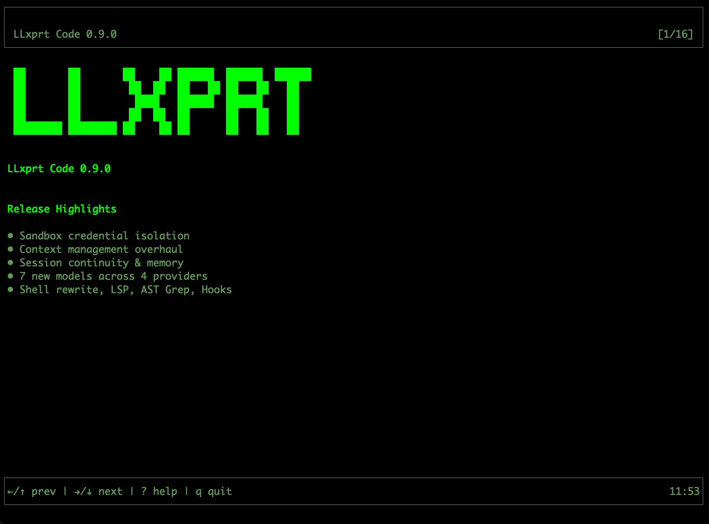

# LLxprt Code 0.9.0: Secrets Stay Home
*2026-03-04*


LLxprt Code 0.9.0 is out. This is the biggest release we've shipped, with 215 issues closed, and a fundamental change in how the agent handles your credentials. Here's what matters.

[](https://youtu.be/QRnCBIA1DLg)

## The Sandbox Gets Real

In February we wrote about [why coding agent security is broken](/blog/rendered/2026-02-20-anti-claw.html). Approval prompts train you to click yes. Sandboxes that cut off the network entirely make real work impossible. Agents leak your PATs or exceed the authority you intended to give them. We laid out what we thought the right architecture looked like, and 0.9.0 is that architecture.

The LLM runs inside a Docker or Podman container. It can see your project files and nothing else. Not your home directory, not `~/.ssh`, not your environment variables. The container runtime enforces the boundary, not the model's good behavior.

When the agent needs to authenticate with an API, it doesn't need your credentials. Requests go through a proxy running on the host. Your OAuth tokens live in your OS keyring, flow through a Unix socket, and never enter the container. The PAT or token is never shared with the LLM.

A prompt injection can't exfiltrate your Anthropic API key because the key isn't in the LLM's environment. A malicious MCP server can't read your OAuth tokens because they aren't in the sandbox. The agent does authenticated work without holding credentials.

The sandbox also constrains CPU and memory. You know how Claude loves to open 15 instances of vitest and brick your system? That's its favorite thing to do. In 0.9.0, a runaway test suite at worst crashes the sandbox, not your system.

## Smarter Context, Longer Sessions

Running out of context mid-task quietly kills autonomous coding sessions. 0.9.0 overhauls how LLxprt manages its context window.

You now choose a compression strategy. **Top-down** summarizes the oldest messages first. **Middle-out** keeps the beginning and end of the conversation intact and compresses the middle. **One-shot** does a single-pass summary of everything. Pick the one that fits how you work.

Alongside the new strategies, there are a number of bug fixes and improvements to how compression calculates thresholds, counts tokens, and recovers from failures. Compression works much better now for longer autonomous sessions without the LLM losing coherence.

## Pick Up Where You Left Off

Sessions now persist properly. The `--continue` flag resumes your last session. The new `/continue` command opens a session browser so you can pick any previous session and replay it.

TODOs survive across sessions. They don't vanish on `--continue` or disappear when you send the next message. The `/todo` menu lets you add, edit, and delete items, so you can fix the model's task list without starting over.

**Core Memory** is new: save preferences and rules directly into the system prompt. Models that respect system directives (like GPT-5.3-Codex) will follow them more reliably than instructions buried in conversation history.

## Images and PDFs Across Providers

Image and PDF support is no longer restricted to Gemini models. 0.9.0 adds media support across Anthropic, OpenAI, OpenAI Responses, and Gemini providers. Drop a screenshot, a design mockup, or a PDF spec into the conversation and the model can read it, regardless of which provider you're using.

## The February Models

0.9.0 adds support for the wave of models released in February:

- **Claude Opus 4.6** and **Claude Sonnet 4.6** from Anthropic
- **GPT-5.3-Codex** and **GPT-5.3-Codex-Spark** from OpenAI
- **Kimi 2.5** from Moonshot
- **DeepSeek Reasoner** from DeepSeek
- **Gemini 3** from Google with thinking level support

Several other new models like **Qwen Next 3.5** and **MiniMax 2.5** also work out of the box without any changes on our side.

Reasoning and thinking blocks now stream incrementally across all providers that support them and display in the correct order. OpenAI Responses streams reasoning blocks. Anthropic thinking persists across full conversations. GPT-5.3-Codex parallel tool calls are bounded to the context window so aggressive tool use doesn't overflow it.

## AST-Aware Tooling and a New Shell

The code tools got significantly smarter. **AST Grep** does structural code search using syntax tree patterns, not text matching. **AST Edit** performs syntax-validated edits with structure awareness. Thanks to [e2720pjk](https://github.com/e2720pjk) for contributing AST Edit. **Structural Analysis** builds call graphs, type hierarchies, and cross-reference maps. These tools understand code as code, not as strings.

The shell command system was rewritten from scratch. The `!` shell mode now has autocomplete. **Interactive PTY mode** lets you press Ctrl-F to send keystrokes to a running process, so when the agent launches something that needs input, you can answer it without killing the session.

LLxprt Code also ships an **experimental LSP server**, wiring Language Server Protocol diagnostics into the edit tools for type-aware feedback after changes.

## Hooks: Automate Around the Agent

The new hook system lets you register scripts that fire on tool events. Pre-hooks run before a tool executes; post-hooks run after. Auto-format files after edits. Run linters after code changes. Enforce project-specific rules. Build custom audit trails. Configure them per-project or globally. See the [hooks documentation](/llxprt-code/docs/hooks/) for details and examples on how to set them up.

## Async Subagents

The LLM can now launch and manage async subagents. Instead of blocking the main conversation while a subtask runs, the agent kicks off background work and keeps going. Use `/task` to see what's running.

Subagents run in-process, can have their own profiles and use a different model from the parent, and don't share context. When a subagent finishes, it sends its results back to the parent and the parent wakes up, even if you're sitting at the input prompt waiting to type something.


## Introducing LLxprt Jefe

When you're working on 8 issues across 4 different projects and have 10 terminals open, it's hard to keep track of which LLxprt is working on what. Who wants to think about sandbox settings for each one?

**LLxprt Jefe** is a new companion product, a terminal dashboard for managing multiple LLxprt Code instances. Launch agents, watch their output in real time, and jump into any conversation when it needs guidance. Persistent tmux sessions mean Jefe auto-reattaches after crashes and calls `--continue` to resume where the agent left off.

For example, I often have up to 7 agents working on different issues on different branches of llxprt-code, all running in Jefe. Meanwhile I might be working on 2-3 other projects in completely different repositories, also managed by Jefe. I swap between them, kill what I'm not using, launch new ones in the sandbox. No more drowning in terminal tabs.

Jefe is in preview and available now:

```
brew tap vybestack/homebrew-tap
brew update
brew install jefe
```

Check it out at [github.com/vybestack/llxprt-jefe](https://github.com/vybestack/llxprt-jefe).

## What's Next

**0.10.0** is a stability-focused release. We're cherry-picking enough from gemini-cli to enable Skills in LLxprt and continuing the migration to OS-standard config paths (XDG on Linux, Library on macOS).

Soon **Jefe** will let you have a heads-up view of all your running sessions without switching between them, so you can see what every agent is doing at a glance.

In **0.11.0** you'll be able to copy and paste from the sandbox clipboard, use Anthropic tool searching, stream over Codex WebSocket connections, and set up Workflows for multi-step automation.

## Get Started

Install or upgrade:

```
npm install -g @vybestack/llxprt-code
```

Or via Homebrew:

```
brew tap vybestack/homebrew-tap
brew update
brew install llxprt-code
```

LLxprt Code is Apache 2.0, open source, and built for the terminal. Check the [documentation](/llxprt-code/docs/), join us on [Discord](https://discord.gg/Wc6dZqWWYv), or dive into the code on [GitHub](https://github.com/vybestack/llxprt-code).

Thanks to contributors [e2720pjk](https://github.com/e2720pjk) and [5i2urom](https://github.com/5i2urom) for their pull requests in this release, and to everyone in the Discord who filed issues and tested nightlies.
